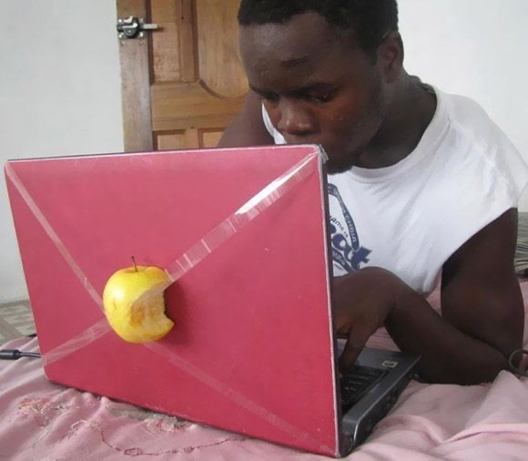
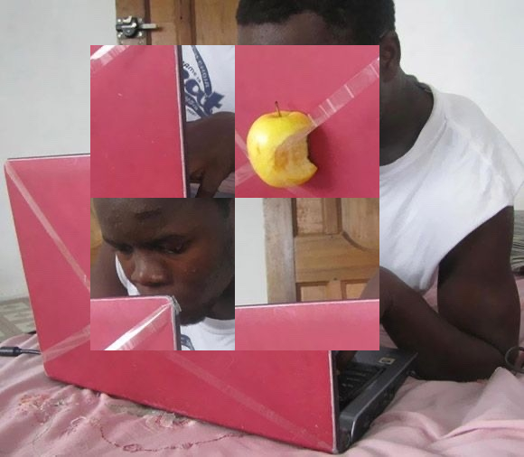
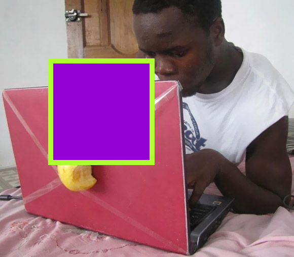
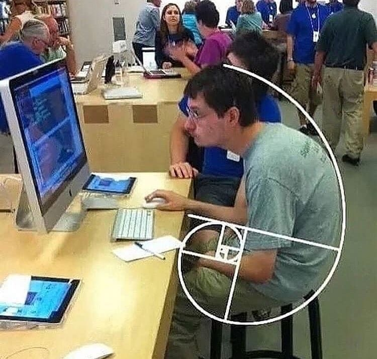
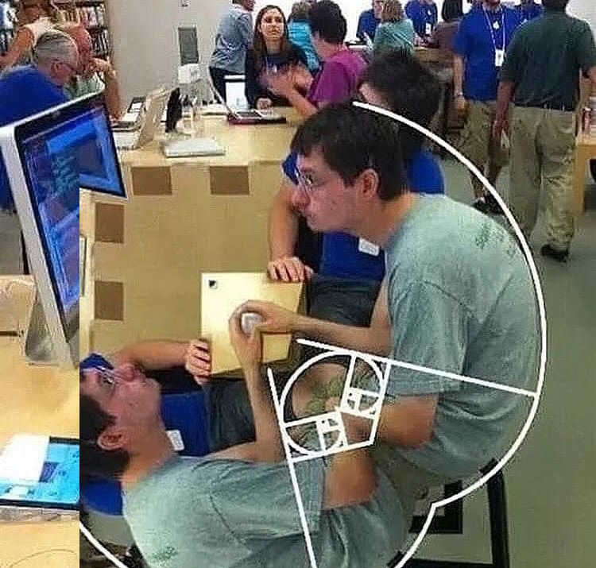
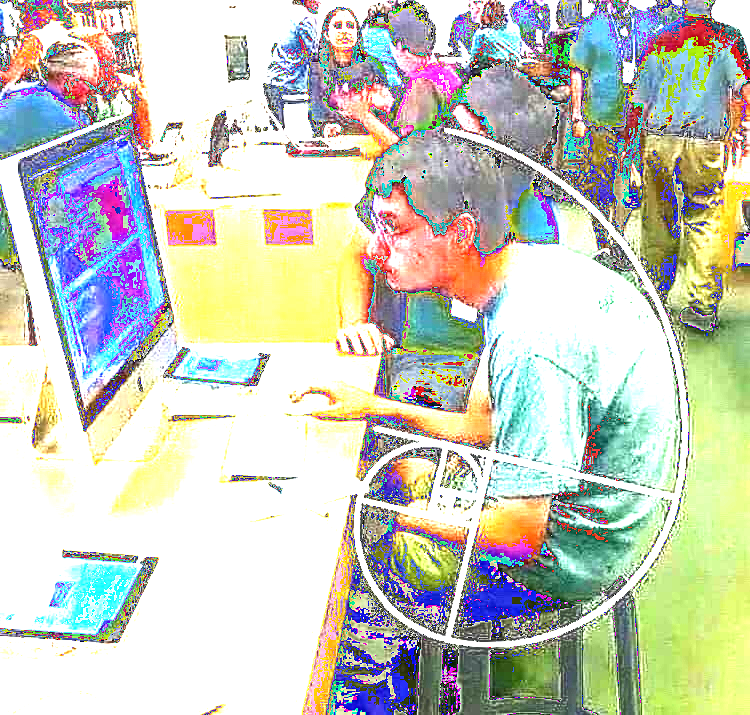
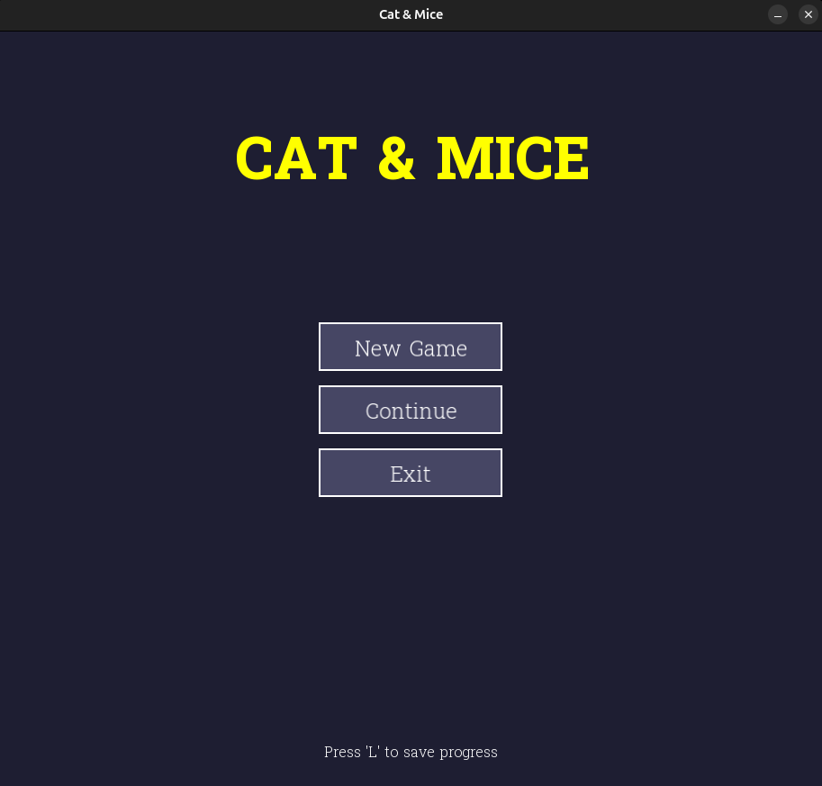
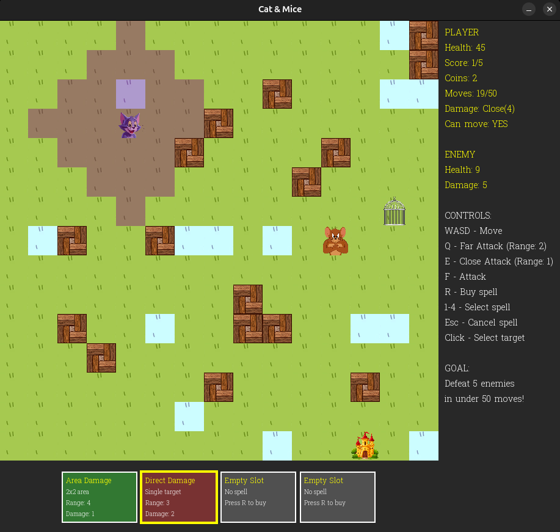

# university_works
В этом репозитории представлены лабораторные и курсовые работы по программированию, алгоритмам и структурам данных, построению и анализу алгоритмов, ООП.
Описание наиболее крупных работ приведено ниже.

**#Обработка изображения на C (Course work 2nd semester)**

Программа представляет собой CLI утилиту, обрабатывающую png-изображение с помощью библиотеки libpng.
Доступны следующие функции:
1. Рисование квадрата с заданными параметрами;
2. Перестановка четырех частей выбранной прямоугольной области в заданном пользователем порядке;
3. Замена наиболее часто встречающегося цвета на заданный.
4. Создание контрастного изображения;
5. Создание рамки для изображения (функция fill_outside);
6. Циклический сдвиг изображения;
7. Рисование ромба заданного цвета;
8. Рисование круга заданного цвета;
9. Отражение по диагонали.

Мануал по работе с утилитой и отчет с подробным описанием программы и примерами обработки изображений представлен в папке *cw2_adds*.

<table align="center">
  <tr>
    <td align="center">
      
       <b>Original</b>
    </td>
    <td align="center">
      
       <b>Exchange peaces</b>
    </td>
    <td align="center">
      
       <b>Draw square</b>
    </td>
  </tr>
   <tr>
    <td align="center">
      
       <b>Original</b>
    </td>
    <td align="center">
      
       <b>Diagonal mirror</b>
    </td>
    <td align="center">
      
       <b>Contrast</b>
    </td>
  </tr>
</table>

**#Игра "Cat & Mice" на языке С++ (Game)**

Проект написан на языке C++, демонстрирует навыки создания классовой архитектуры в соответствии с принципами ООП, работы с файлами формата JSON, создания графического интерфейса.

Суть и правила игры:

Остаться в живых и победить врага за ограниченное количество ходов, используя различные атаки и заклинания. В рандомных местах карты находится враг и его вражеская башня, передвижение игрока затруднено препятствиями и замедляющими клетками. Игрок может использовать два типа атаки: ближний (*"E"*) и дальний (*"Q"*) бой (атака происходит при нажатии *"F"*), приносящие монеты. Монеты можно потратить на покупку заклинаний на текущем уровне (на следующем уровне неиспользованные монеты обнуляются), стоимость одного заклинания *5 монет*. При нажатии клавиши *"R"* в колоду случайным образом добавляется карта одного из трех возможных заклинаний. Для применения заклинания нужно нажать клавишу с цифрой слота, на котором находится заклинание (*1-4*), и выбрать клетку из подсвеченной цветом области. В начале игры у игрока есть одно случайное заклинание. Если после прохождения уровня у игрока остались заклинания, на следующий уровень переносится только половина карточек. Уровень пройден, когда выполнена его цель по количеству уничтоженных врагов и не превышено допустимое число ходов. Ходы тратятся при передвижении, смене типа боя, выполнении атаки, покупке и применении заклинания. При победе появляется возможность *улучшить характеристики* игрока: повысить здоровье, урон атаки или заклинания. От уровня к уровню эффекты улучшений накапливаются и упрощают прохождение игры. Существует возможность *сохранить* текущий прогресс: нажать клавишу *"L"* в нужный момент, затем в меню выбрать кнопку *"Continue"*. 

Виды заклинаний:
* *Trap* - постановка ловушки в любую клетку поля. При попадании в клетку с ловушкой враг теряет здоровье.
* *Direct Damage* - заклинание прямого урона: враг, находящийся в достижимой области, получает урон при нажатии на клетку.
* *Area Damage* - заклинание урона по площади: при использовании в допустимом радиусе наносит урон по области 2 на 2 клетки, даже если там нет врага.

Детальное рассмотрение программной реализации представлено в отчетах в папке *game_reports*.

Запуск: скачать архив из раздела ***Releases*** (только для Linux).

<table align="center">
  <tr>
    <td align="center">
      
       <b>Main page</b>
    </td>
    <td align="center">
      
       <b>Gameplay</b>
    </td>
</table>

**#Программа на языке С++ для онлайн-заказов в кафе (Course work 3rd semester)**

Программа реализует два режима работы: администраторский и клиентский, предоставляя функционал для управления меню блюд и формирования заказов. В системе администратор может добавлять, удалять и изменять цены блюд в меню, в то время как клиенты имеют возможность просматривать меню, выбирать блюда для заказа, управлять содержимым корзины и рассчитывать итоговую стоимость.

Для переключения в режим администратора использовать пароль *1503*.

Запуск: ./cw3 из папки build.

**#Алгоритмы (algorithms)**

Алгоритмы и структуры данных (АиСД, 3 семестр) -- реализация сортировки и структур данных:
* TimSort
* Circular deque (кольцевая дека)
* Rope
* Segment tree (дерево отрезков)

Построение и анализ алгоритмов (ПиАА, 4 семестр) -- реализация алгоритмов:
* Backtracking (задача о квадрировании квадрата)
* TSP (задача коммивояжера, точное и приближенное решения)
* Knuth–Morris–Pratt algorithm (поиск подстроки в строке)
* Aho-Corasick algorithm (поиск набора подстрок в тексте)
